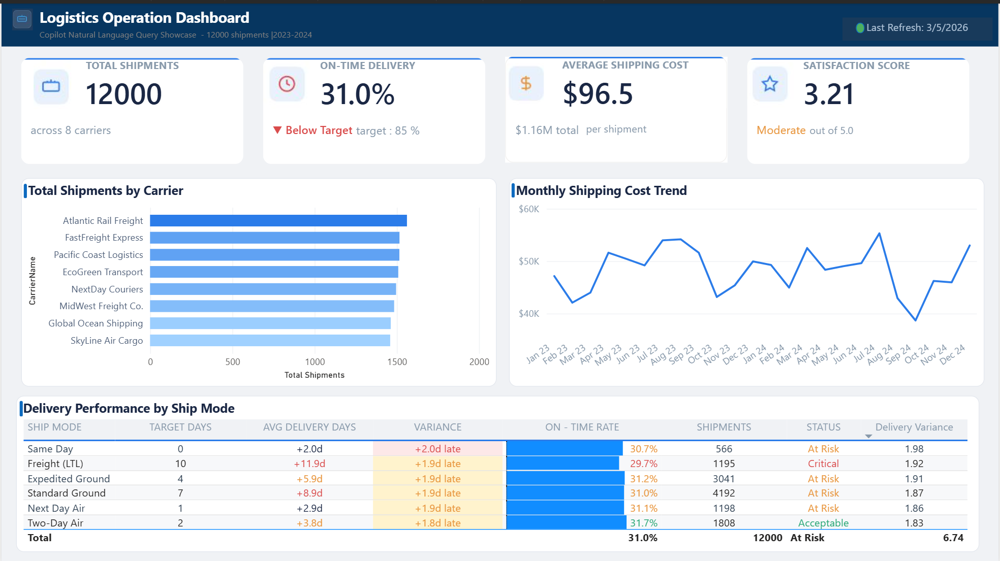
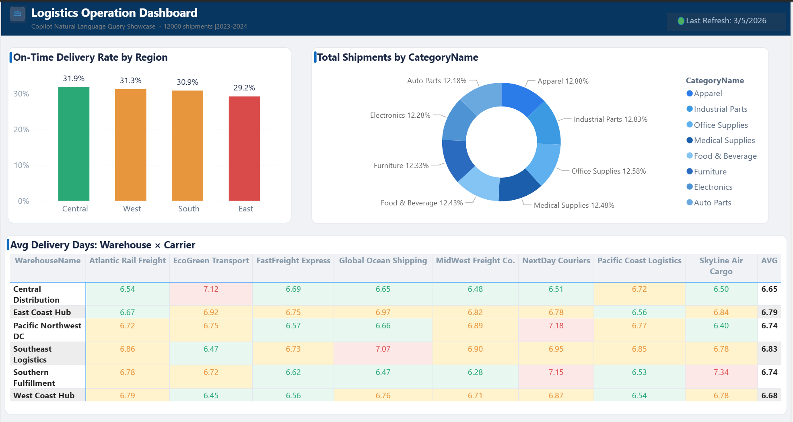
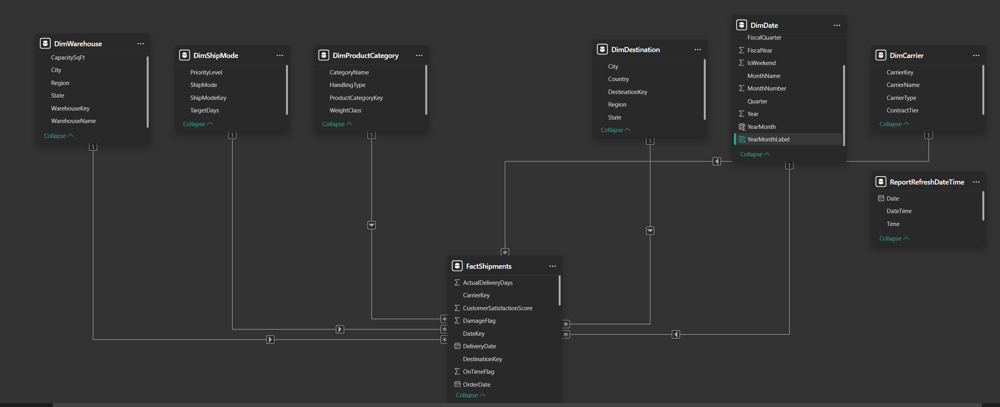

# Copilot Natural Language Query Showcase

> A Power BI proof-of-concept demonstrating AI-powered analytics through Copilot natural language queries on a logistics dataset of 12,000 shipments across 8 carriers, 6 warehouses, and 30 US destinations.

---

## Overview

This project explores how Power BI Copilot can democratize data access by allowing business users to ask questions in plain English and receive instant visual answers. The semantic model is specifically designed and optimized for natural language interaction — with descriptive measure names, a clean star schema, and well-documented column descriptions.

**Key Question:** Can a logistics operations team replace ad-hoc report requests with natural language queries?

---

## Dashboard Preview

### Page 1: Operations Overview



### Page 2: Regional Analysis



---

## Data Model



The semantic model follows a **star schema** design with one fact table and six dimension tables:

| Table | Rows | Description | Key Columns |
|:------|-----:|:------------|:------------|
| **FactShipments** | 12,000 | Shipment transactions (2023–2024) | ShipmentID, ShippingCost, ActualDeliveryDays, OnTimeFlag |
| **DimCarrier** | 8 | Carrier companies | CarrierName, CarrierType, ContractTier |
| **DimWarehouse** | 6 | Distribution centers | WarehouseName, Region, CapacitySqFt |
| **DimShipMode** | 6 | Shipping modes with SLA targets | ShipMode, TargetDays, PriorityLevel |
| **DimProductCategory** | 8 | Product categories | CategoryName, WeightClass, HandlingType |
| **DimDestination** | 30 | US destination cities | City, State, Region |
| **DimDate** | 731 | Calendar dimension | Date, Year, Quarter, MonthName |

---

## Key Metrics

| Metric | Value | Status |
|:-------|:------|:-------|
| Total Shipments | 12,000 | — |
| On-Time Delivery Rate | 31.0% | Below 85% target |
| Average Shipping Cost | $96.54 per shipment | $1.16M total |
| Average Delivery Days | 6.7 days | — |
| Average Satisfaction Score | 3.21 / 5.0 | Moderate |
| Damage Rate | ~3% | — |
| Return Rate | ~5% | — |

---

## DAX Measures (12 Total)

### Core Measures

```dax
Total Shipments = COUNTROWS(FactShipments)

Total Shipping Cost = SUM(FactShipments[ShippingCost])

Average Shipping Cost = AVERAGE(FactShipments[ShippingCost])

Cost per Shipment = DIVIDE([Total Shipping Cost], [Total Shipments], 0)

Average Delivery Days = AVERAGE(FactShipments[ActualDeliveryDays])
```

### Performance Measures

```dax
On-Time Delivery Rate =
    DIVIDE(
        COUNTROWS(FILTER(FactShipments, FactShipments[OnTimeFlag] = 1)),
        COUNTROWS(FactShipments), 0
    )

Delivery Variance =
    VAR AvgActual = AVERAGE(FactShipments[ActualDeliveryDays])
    VAR Target = SELECTEDVALUE(DimShipMode[TargetDays], 0)
    RETURN AvgActual - Target

Delivery Status =
    VAR Rate = [On-Time Delivery Rate]
    RETURN
        SWITCH(TRUE(),
            Rate >= 0.315, "Acceptable",
            Rate >= 0.300, "At Risk",
            "Critical"
        )
```

### Quality Measures

```dax
Damage Rate =
    DIVIDE(
        COUNTROWS(FILTER(FactShipments, FactShipments[DamageFlag] = 1)),
        COUNTROWS(FactShipments), 0
    )

Return Rate =
    DIVIDE(
        COUNTROWS(FILTER(FactShipments, FactShipments[ReturnFlag] = 1)),
        COUNTROWS(FactShipments), 0
    )

Average Satisfaction Score = AVERAGE(FactShipments[CustomerSatisfactionScore])
```

---

## Natural Language Use Cases

26 queries documented across 6 business categories. Here are the highlights:

### Simple Queries (Copilot accuracy: ~90%)

| Query | Expected Result | Business Value |
|:------|:----------------|:---------------|
| "How many shipments last month?" | ~500 (single KPI) | Quick volume check |
| "What is our on-time delivery rate?" | 31.0% | Core KPI monitoring |
| "Total shipping cost this year" | ~$580K | Budget tracking |
| "Average satisfaction score" | 3.21 / 5.0 | Service quality pulse |

### Moderate Queries (Copilot accuracy: ~70%)

| Query | Expected Result | Business Value |
|:------|:----------------|:---------------|
| "On-time rate by carrier" | Bar chart, 8 carriers | Performance comparison |
| "Compare air vs ground cost" | Air ~$150 / Ground ~$65 | Mode selection |
| "Damage rate for electronics" | ~3% | Quality monitoring |
| "Satisfaction trend over time" | Monthly line chart | Long-term tracking |

### Complex Queries (Pre-built report recommended)

| Query | Why Copilot Struggles | Recommended Approach |
|:------|:---------------------|:--------------------|
| "Which carrier improved most YoY?" | Multi-step calculation | Pre-build a YoY measure |
| "Cost per shipment trend by carrier type" | Multi-line chart with grouping | Pre-built report page |
| "Correlation: delay vs satisfaction" | Scatter plot with analysis | Pre-built visual |

> Full matrix with all 26 queries available in [docs/use-case-matrix.md](docs/use-case-matrix.md)

---

## Copilot Evaluation Summary

| Complexity | Use Cases | Accuracy | Verdict |
|:-----------|----------:|---------:|:--------|
| Simple (single aggregation) | 12 | ~90–95% | Reliable for ad-hoc questions |
| Moderate (breakdown + filter) | 10 | ~65–75% | Usually works, may need rephrasing |
| Complex (multi-step, time intelligence) | 4 | ~25–40% | Pre-built report recommended |

**Key Finding:** Copilot's accuracy depends more on semantic model quality than on the question complexity. Descriptive measure names, a clean star schema, and hidden technical columns are the biggest factors.

> Full evaluation report: [docs/copilot-evaluation.md](docs/copilot-evaluation.md)

---

## Project Structure

```
copilot-nl-query-showcase/
├── README.md
├── data/
│   ├── FactShipments.csv          # 12,000 shipment records
│   ├── DimCarrier.csv             # 8 carrier companies
│   ├── DimWarehouse.csv           # 6 distribution centers
│   ├── DimShipMode.csv            # 6 shipping modes
│   ├── DimProductCategory.csv     # 8 product categories
│   ├── DimDestination.csv         # 30 US destinations
│   └── DimDate.csv                # 731-day calendar
├── screenshots/
│   ├── data-model.png
│   ├── dashboard-page1.png
│   └── dashboard-page2.png
├── docs/
│   ├── use-case-matrix.md         # 26 NL query use cases
│   └── copilot-evaluation.md      # Copilot capability assessment
└── pbix/
    └── logistics-copilot-demo.pbix
```

---

## Tools & Technologies

- **Microsoft Power BI Desktop** — Semantic model, DAX measures, report design
- **Power BI Copilot** — Natural language query interface
- **DAX** — 12 measures optimized for NL query recognition
- **Star Schema** — 1 fact table + 6 dimension tables for query accuracy

---

## How to Use This Project

1. Clone this repository:
   ```bash
   git clone https://github.com/yourusername/copilot-nl-query-showcase.git
   ```

2. Open `pbix/logistics-copilot-demo.pbix` in Power BI Desktop

3. Explore the data model in **Model View** (left sidebar)

4. Review the DAX measures in the Fields pane

5. If you have Copilot access, try the queries from the use case matrix

6. Review the two report pages for pre-built analytics

---

## Model Design Decisions

| Decision | Rationale |
|:---------|:----------|
| Descriptive measure names ("On-Time Delivery Rate" not "OTD_PCT") | Copilot matches user queries to measure names via text similarity |
| All keys hidden from report view | Prevents Copilot from referencing surrogate keys |
| DimDate marked as date table | Enables Copilot's full time intelligence |
| Single star schema (no snowflake) | One join path from any dimension to fact — reduces Copilot ambiguity |
| Separate display vs. numeric measures for Variance | Numeric measure for conditional formatting, text measure for display |

---

## License

MIT License — see [LICENSE](LICENSE) for details.
